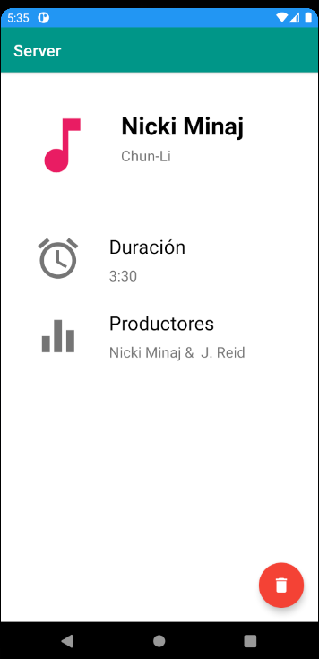

# Arquitectura básica Cliente-Servidor
Los puntos y objetivos más importantes de este repositorio se comentan a continuación.
- Crear una arquitectura básica Cliente-Servidor:
  - El servidor se ha llevado a cabo con **NodeJS** y concretamente con el uso del framework de **KoaJS**. En él pretendemos simular una *API REST* que serviría para gestionar los datos de la aplicación (un catálogo de canciones con la información de cada una). El código del servidor se puede encontrar en la carpeta [server_node](./server_node).
  
  - El cliente se ha llevado a cabo en una aplicación de Android. 
  
- Dentro de esta aplicación se han probado dos herramientas (con el objetivo de compararlas) para la comunicación con servidores o en otras palabras, para llevar a cabo peticiones *HTTP*:
    - Volley.
    - Retrofit2.

## Capturas de la aplicación. Funcionalidad.

En este apartado explico las diferentes peticiones que hemos llevado a cabo en la aplicación.

- GET de todas las canciones.

- GET de una canción concreta (pinchando sobre una de las card).

- POST de una canción (se puede elegir si enviar con Retrofit o con Volley) pinchando sobre el FAB de inicio.

## Otros

En el código de la aplicación también puedes encontrar:

- El patrón de RecyclerView (para la lista de canciones).
- Envío de Toast.
- Utilización de clases *Singleton*, por ejemplo para el servicio de Retrofit y de esta forma obtener una mejor organización del código.

**Nota:** la aplicación está desarrollada para hacer las peticiones a una máquina remota donde está desplegado el servidor. Si deseas probarlo tienes que desplegar tú mismo el servidor y adaptar la *url* en la clase Utils.